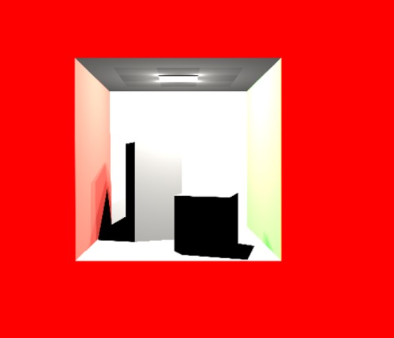

# Computer graphics in Game development course

This repo contains a template for Computer graphics in Game development labs

## Pre-requirements

- Version control: [Git](https://git-scm.com/)
- Build automation: [CMake](https://cmake.org/download/)
- C++ compiler: MSVC on Windows, Clang on MacOS, GCC on Linux (C++17 compatible)
- [OpenMP library](https://www.openmp.org/)
- Source code editor: [Visual Studio Code](https://code.visualstudio.com/Download)

For DirectX12 you need a Windows machine or VM with installed software and [Windows SDK](https://developer.microsoft.com/en-us/windows/downloads/windows-sdk/).
For graphics debugging you may to install [Microsoft PIX](https://devblogs.microsoft.com/pix/download/).

## How to build the solution

Use `git clone --recursive` to clone the repo with submodules or run `git submodule update --init --recursive` after the first clone.

Go to the project folder and run the next command:

```sh
mkdir Build
cd Build
cmake ..
```

## Third-party tools and data

- [STB](https://github.com/nothings/stb) by Sean Barrett (Public Domain)
- [Linalg.h](https://github.com/sgorsten/linalg) by Sterling Orsten (The Unlicense)
- [Tinyobjloader](https://github.com/syoyo/tinyobjloader) by Syoyo Fujita (MIT License)
- [Cxxopts](https://github.com/jarro2783/cxxopts) by jarro2783 (MIT License)
- [Cornell Box models](https://casual-effects.com/g3d/data10/index.html#) by Morgan McGuire (CC BY 3.0 License)
- [Cube model](https://casual-effects.com/g3d/data10/index.html#) by Morgan McGuire (CC BY 3.0 License)
- [Teapot model](https://casual-effects.com/g3d/data10/common/model/teapot/teapot.zip) by Martin Newell (CC0 License)
- [Dabrovic Sponza model](https://casual-effects.com/g3d/data10/index.html#) by Marko Dabrovic (CC BY-NC License)

## Testing
Build and go to `out\build\x64-Debug`, then run
```
.\Rasterization.exe --model_path=../../../models/cube.obj
# or
.\Rasterization.exe --model_path=../../../models/z_test.obj
```

# Rasterization


# Raytracing
